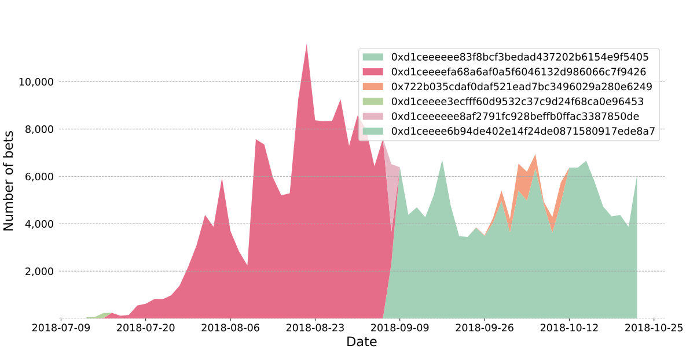
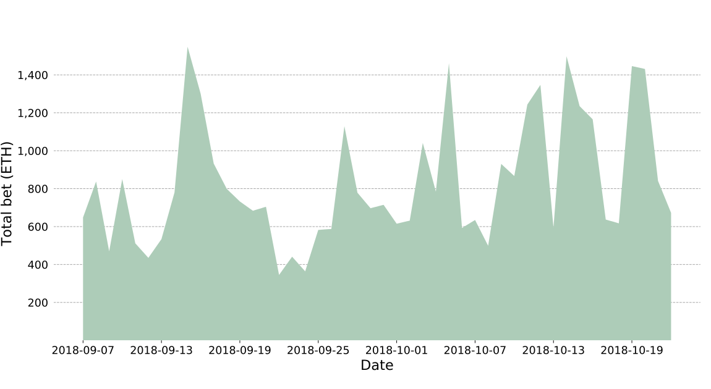
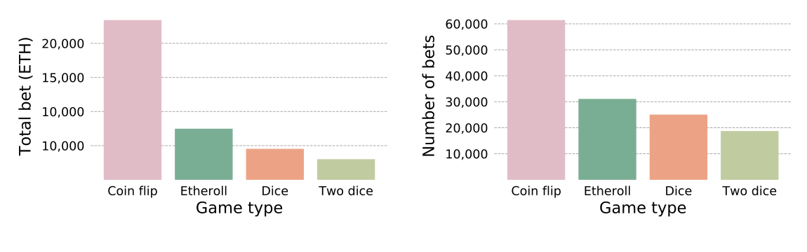
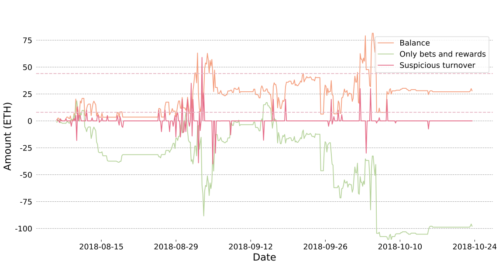
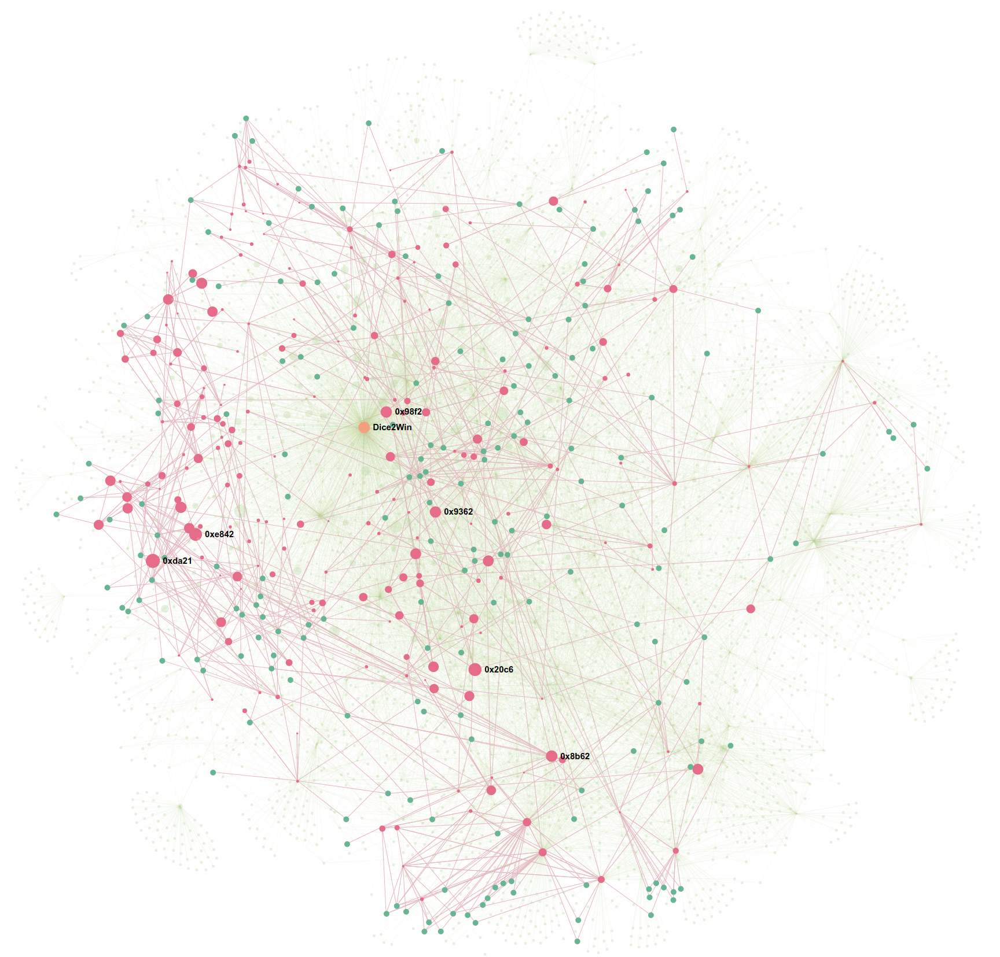
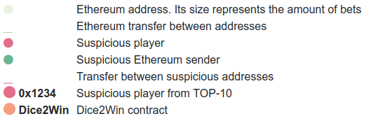
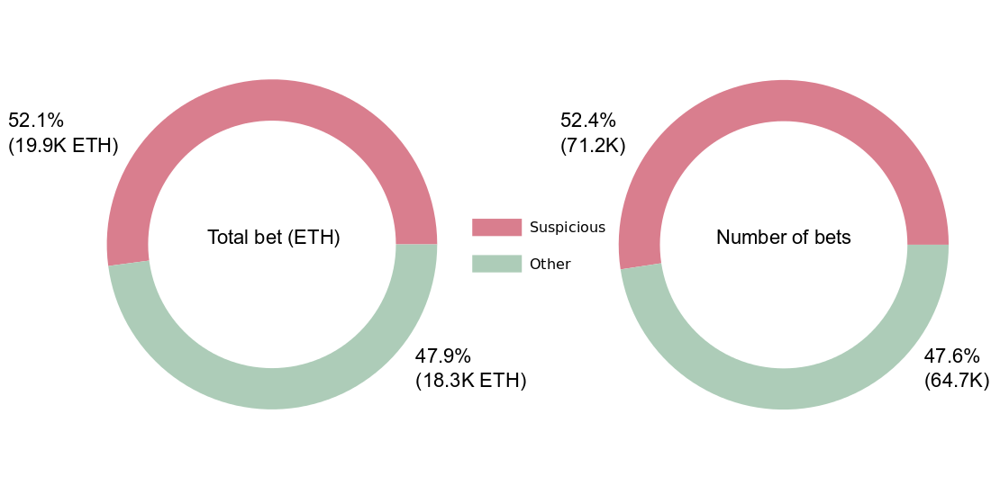
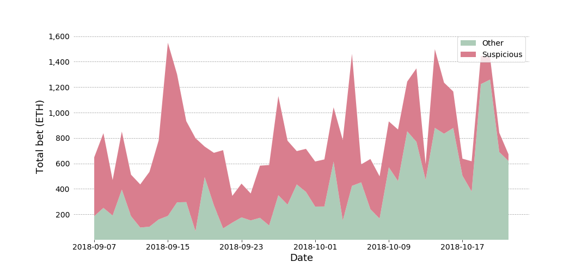
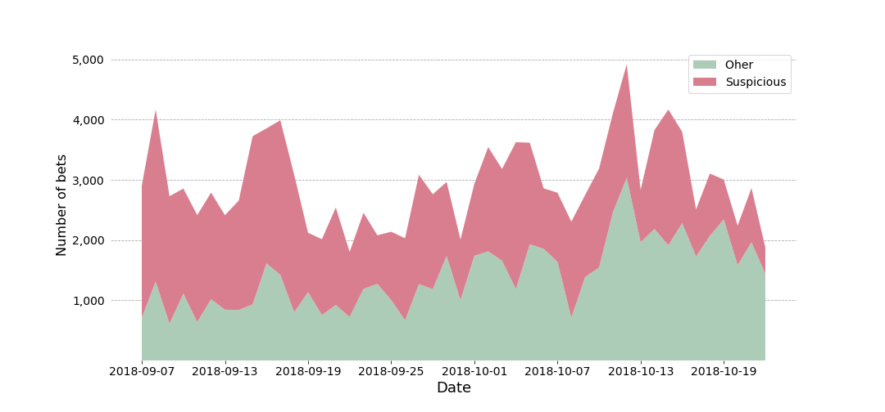

# DApp Transactions Analysis: Dice2Win Case Study

Blockchains have introduced unprecedented transparency of economic agents activity that helps analyse this activity from different perspectives. One of our previous articles shows how one system influences the metrics of the whole Ethereum network.

The structures containing a relatively low number of tightly connected addresses, that have a great influence in the network, also exist in some DApps. The objective of this article is to check the presence of such structures in Dice2Win that might mean the casino uses the rigged turnover.

## Game mechanics
The general bet mechanics in Dice2Win is the following:
1. A user sends a transaction to casino contract by calling the placeBet method. In the parameters of the call the user selects a number of sides on a simulated dice – modulo, selected sides for the bet – betMask, and commit – the number, provided by Dice2Win and used at a later stage to define the outcome of the bet.
2. A croupier bot sends a transaction by calling the settleBet method. This method combines the number-commit with the block hash related to the bet. Based on this combination the keccak256-hash is calculated and with its help the outcome of the bet is defined. If the bet wins, the player gets a reward, otherwise he receives 1 Wei as a consolation prize.

At present Dice2Win offers the following bets:
- coin flip: in this case modulo equals 2;
- roll a dice: modulo equals 6;
- two dice: modulo equals 36
- etheroll: modulo equals 100

The amount of Ethereum used in bets should be over 0.05 ETH.

## General statistics
Dice2Win contract, which has been changed five times, is the main contract of the service. In parallel there was at least one contract with the same interface that co-existed with the main one. Figure 1 illustrates the period of activity for each contract version. In our research we used only the actual version of this contract with the address 0xd1ceeeeee83f8bcf3bedad437202b6154e9f5405.

<i>Figure 1. Number of bets over time for Dice2Win contract versions</i>

In total 817 players have placed their bets, the total number of bets is 93380. An average bet equals 0.2635, the total amount of all bets equals 24607.387 ETH. Dice2Win turnover displayed in figure 2.

<i>Figure 2. Dice2Win overall amount of bets over time.</i>

The most popular bet is coin flip: this type of game is leading both by the number of transactions and by the number of bets. Figure 3 represents the popularity of each game type.

<i>Figure 3. Dice2Win overall bet volume and amount for each game type.</i>

48 out of 817 players have places the bets in the amount of more than 100 ETH. The volume of bets placed by these players equals 83.7% (28316.71 ETH), whereas  their amount is only 5.9% (48 addresses) of the total number. Figure 4 represents the proportions between different metrics for top addresses and for rest of them.

<i>Figure 4. Dice2Win overall bet volume and amount for players from top players and the rest of them</i>

## Suspicious addresses
Taking a closer look at top-addresses statistics we could define a group of wallets which have a relatively low number of Ethereum recipients and senders:

- 0x292eb4da428d13a2b13ea9257a58781f9037de65 - 4 unique recipients and senders;
- 0x34241da47768670cf372da49849c0bb86e6b3aae - 2 unique recipients and 3 senders;
- 0x768052831f753f7aa532b0d8751d5a5c22377681 - 3 unique recipients and 5 senders;
- 0x355e2479ca4b494296b4d3c08e5c3c57cffd0dd1 - 6 unique recipients and 4 senders;

Interestingly, the last address, unlike the first three ones, interacted more often with usual wallets than with stock markets. Having analyzed its interactions, we came to the conclusion that among its recipients and senders there was a large number of addresses, which also placed bets in Dice2Win. To define the scale of these interactions and their influence on the economy of the service we have analyzed the graph of transactions between the addresses, which had sent the bets in Dice2Win.

In order to show how the service creates rigged transactions, let’s take a look at the top player’s wallet 0xda2101021a7937e4c12036205f16694ef1e7a3c0, as its turnover seemed suspicious to us. Figure 5 shows the change of its balance. As you can see from the chart, its profit from gambling is negative, but the balance stays positive for a long time. Further research shows there is a group of addresses that charge up the wallet’s balance each time it falls under 8 ETH. It is worth noting that the address returns Ethereum when its balance is high enough to place bets (supposedly, it happens when it overcomes the barrier of 45 ETH).

<i>Figure 5. Balance of the suspicious player over time </i>

Taking a closer look at the environment of the address, it is possible to note that 54 ETH was received from 0xdf95de30cdff4381b69f9e4fa8dddce31a0128df. It is indicative that apart from this transaction this address sent Ethereum to other top players, for instance, to 0x17d8e86af16cd6a5fdd5eb04ace17a4461151781 or 0x40584ddb22779dc7280cd09deecca4771f785542. With its help, 28 dice2win players got 388.5 ETH in total, however no players sent transactions in response.

## Graph analysis:  transactions between players
To find tightly connected groups of addresses, we did the following:
1. Collected a list of addresses that sent Ethereum to Dice2Win players. A player is anyone who calls the sendBet method of Dice2Win contract.
2. Removed smart contracts and named etherscan.io addresses from the dataset.
3. Built a graph with players and senders of Ethereum represented as nodes. The nodes are connected with an edge if there is at least one transaction between them.

As a result, we can detect 234 players, that have received Ethereum from the addresses that are not contracts and don’t have names on etherscan.io. If we show their interconnections, we will get a graph presented in figure 6

<i>Figure 6. Suspicious players and their ties in relation with the rest of casino players' interconnections</i>

As we can see, most of addresses are situated within the biggest connected component. It contains 406 addresses, 24 addresses are outside of this group. The number of players in the group equals 215. Further analysis showed that the volume of all bets in the main component equals 50.9% of the total, and the number of bets is 44.4% of the total, these proportions represented in figure 6. The changes of the numbers of bets and their volume over time within the main component and in total are displayed in figure 7.

<i>Figure 7. Dice2Win overall volume and number of bets for common and suspicious players </i>

<i>Figure 7. Amount of bets for common and suspicious players over time</i>

<i>Figure 7. Number of bets for common and suspicious players over time</i>

## Conclusion
The presence of an influential suspicious agent in Dice2Win makes it possible to suggest about the rigged number of contract transactions. According to the research, more than a half of top casino players participate in the suspicious turnover (see table 1), and its volume is more than 50% of total Dice2Win turnover. 

We haven't found a fixed address which charges up the players' balance when they are lack of Ethereum. However it's possible that a group of wallets created with the same purpose might exist. One of these wallets has been found and described in the research. 

| Address| Sum of bets, ETH | Count of bets | Suspicious | 
|--------|------------------|---------------|------------|
|0x29fdad5abdef72ce108122d5b1a7065464e2a86f|4597.78|1447|No|
|0xda2101021a7937e4c12036205f16694ef1e7a3c0|3344.43|1447|Yes|
|0x292eb4da428d13a2b13ea9257a58781f9037de65|2037.18|3737|No|
|0x20c61d2dfc6cb4e1735c77505efc0c342aa652ba|1791.21|6405|Yes|
|0xe8427e331f2199c76f1c927e95da55d8c33cd29f|1615.46|1376|Yes|
|0xf9c9ef9a9a494adff0ab70cf29d7a48dec3c6169|912.64|1259|No|
|0xc478a2cb29ecf7a958b8b4754794f48fe596e26b|828.3|1869|No|
|0x8b625faad1e3dad266c4e33020d1be0277018b6c|807.53|4122|Yes|
|0x98f2ae6b26fa1669192689fd12fe42e495fbac03|723.26|1964|Yes|
|0x17d8e86af16cd6a5fdd5eb04ace17a4461151781|675.4|1759|Yes|

<i>Table 1. TOP-10 players and their participation in rigged turnover</i>

